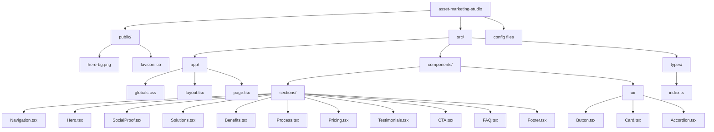
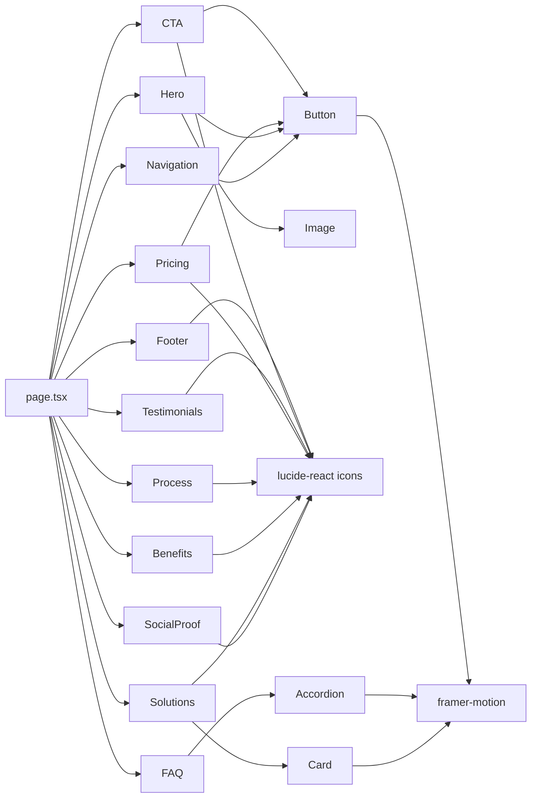

# Asset Marketing Studio - Project Structure

## Current Project Structure

```mermaid
graph TD
    A[asset-marketing-studio] --> B[public/]
    A --> C[src/]
    A --> D[config files]
    
    B --> B1[hero-bg.png - USED]
    B --> B2[file.svg - UNUSED]
    B --> B3[globe.svg - UNUSED]
    B --> B4[header-bg.png - UNUSED]
    B --> B5[header-image.png - UNUSED]
    B --> B6[hero-image-bg.png - UNUSED]
    B --> B7[logo.png - UNUSED]
    B --> B8[next.svg - UNUSED]
    B --> B9[vercel.svg - UNUSED]
    B --> B10[window.svg - UNUSED]
    
    C --> C1[app/]
    C --> C2[components/]
    C --> C3[types/]
    C --> C4[images/ - EMPTY]
    C --> C5[utils/ - EMPTY]
    
    C1 --> C11[globals.css]
    C1 --> C12[layout.tsx]
    C1 --> C13[page.tsx]
    
    C2 --> C21[sections/]
    C2 --> C22[ui/]
    C2 --> C23[layout/ - EMPTY]
    
    C21 --> C211[Navigation.tsx]
    C21 --> C212[Hero.tsx]
    C21 --> C213[SocialProof.tsx]
    C21 --> C214[Solutions.tsx]
    C21 --> C215[Benefits.tsx]
    C21 --> C216[Process.tsx]
    C21 --> C217[Pricing.tsx]
    C21 --> C218[Testimonials.tsx]
    C21 --> C219[CTA.tsx]
    C21 --> C2110[FAQ.tsx]
    C21 --> C2111[Footer.tsx]
    
    C22 --> C221[Button.tsx]
    C22 --> C222[Card.tsx]
    C22 --> C223[Accordion.tsx]
    
    C3 --> C31[index.ts]
```



## Recommended Clean Structure



## Component Dependencies



## Type Usage Analysis

```mermaid
graph TD
    A[types/index.ts] --> B[ButtonProps - USED]
    A --> C[CardProps - USED]
    A --> D[AccordionItemProps - USED]
    A --> E[ServiceProps - UNUSED]
    A --> F[BenefitProps - UNUSED]
    A --> G[ProcessStepProps - UNUSED]
    A --> H[PricingPlan - USED]
    A --> I[TestimonialProps - USED]
    A --> J[FAQItem - USED]