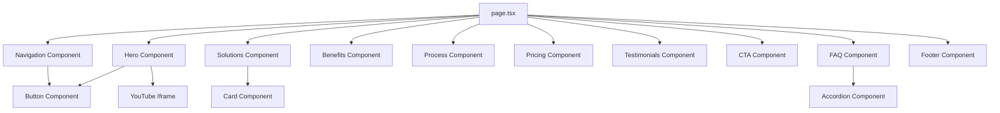

# API Documentation

This document provides information about the APIs, services, and external integrations used in the Asset Marketing Studio project.

## 📋 Table of Contents

- [External Services](#external-services)
- [Third-Party Libraries](#third-party-libraries)
- [Data Flow](#data-flow)
- [API Integration Guidelines](#api-integration-guidelines)

## 🌐 External Services

### YouTube API

The website embeds a YouTube video in the Hero section to showcase the agency's services.

**Implementation Details:**
- **Endpoint**: Embedded YouTube iframe
- **Video ID**: `4K4xOtBcuTo`
- **Usage**: Displayed in the Hero section
- **Implementation**: Client-side iframe embedding with timestamp cache busting

```typescript
// Example implementation from Hero.tsx
const [iframeSrc, setIframeSrc] = useState('');

useEffect(() => {
  // Set the iframe src with a timestamp only on the client side
  setIframeSrc(`https://www.youtube.com/embed/4K4xOtBcuTo?cb=${Date.now()}`);
}, []);
```

**Considerations:**
- Video is embedded directly via iframe
- No API key required for basic embedding
- Timestamp parameter prevents caching issues
- Client-side only implementation to avoid SSR issues

## 📦 Third-Party Libraries

### Framer Motion

Animation library used for smooth transitions and micro-interactions throughout the website.

**Key Features Used:**
- `motion` components for animating HTML elements
- `AnimatePresence` for enter/exit animations
- Animation variants and transitions
- Scroll-triggered animations

**Example Implementation:**
```typescript
import { motion, AnimatePresence } from 'framer-motion';

<motion.h1
  className="text-4xl md:text-6xl font-bold text-white mb-6"
  initial={{ opacity: 0, y: 30 }}
  animate={{ opacity: 1, y: 0 }}
  transition={{ duration: 0.8 }}
>
  Double your sells in <span className="text-yellow-400">90 days</span> or it's free
</motion.h1>
```

### Lucide React

Icon library providing consistent, scalable icons for the user interface.

**Icons Used:**
- Navigation: `Menu`, `X`
- UI Elements: `ArrowRight`, `Loader2`
- Various section-specific icons

**Example Implementation:**
```typescript
import { ArrowRight } from 'lucide-react';

<ArrowRight className="ml-2 h-5 w-5" style={{ color: 'black' }} />
```

## 🔄 Data Flow

### Static Data Architecture

The Asset Marketing Studio website uses a static data approach with no backend API calls:

1. **Content Management**: All content is hardcoded in React components
2. **No Server-Side Rendering**: Client-side rendering for dynamic components
3. **Static Assets**: Images and media files served from the `public` directory

### Component Data Flow



## 🔌 API Integration Guidelines

### Adding New External Services

When integrating new external services or APIs:

1. **Security First**
   - Never expose API keys in client-side code
   - Use environment variables for sensitive data
   - Implement proper error handling

2. **Performance Considerations**
   - Implement loading states for async operations
   - Use proper caching strategies
   - Optimize bundle size by importing only needed modules

3. **Error Handling**
   - Implement try-catch blocks for API calls
   - Provide user-friendly error messages
   - Add fallback content when external services fail

### Environment Variables

For future API integrations, use the following pattern:

```typescript
// Example for future API integration
const API_BASE_URL = process.env.NEXT_PUBLIC_API_URL || 'https://api.theassetstudio.com';
const API_KEY = process.env.API_KEY; // Server-side only
```

### Recommended External Services

Based on the website's functionality, these services might be useful in the future:

1. **Contact Form Service**: Formspree, Netlify Forms, or custom backend
2. **Analytics**: Google Analytics, Plausible, or Fathom
3. **CRM Integration**: HubSpot, Salesforce, or ConvertKit
4. **A/B Testing**: Optimizely or VWO
5. **Performance Monitoring**: Sentry or LogRocket

## 🔐 Security Considerations

### YouTube Embedding Security

- YouTube iframe is embedded with recommended security parameters
- No sensitive data is exposed
- Content Security Policy (CSP) should allow YouTube iframe sources

### Future API Security

When implementing APIs in the future:

1. Use HTTPS for all API communications
2. Implement proper authentication and authorization
3. Validate and sanitize all inputs
4. Implement rate limiting
5. Use CORS properly

## 📊 Performance Impact

### Current API Usage

- YouTube iframe loads asynchronously after component mount
- No blocking API calls
- Minimal performance impact from current integrations

### Optimization Recommendations

1. **Lazy Loading**: Implement for YouTube video if not immediately visible
2. **Caching**: Cache API responses when implementing new services
3. **Bundle Optimization**: Code-split API integration logic
4. **CDN Usage**: Use CDN for external assets when possible

## 🔄 Future API Architecture

For future enhancements, consider implementing:

1. **Headless CMS**: Strapi, Contentful, or Sanity for content management
2. **Contact Form API**: Custom backend or third-party service
3. **Analytics API**: Custom tracking implementation
4. **CRM Integration**: Automated lead capture and management

## 📝 API Development Guidelines

When adding new API integrations:

1. Follow the existing TypeScript patterns
2. Implement proper error boundaries
3. Add loading states for better UX
4. Document new integrations in this file
5. Update the CHANGELOG.md with API changes
6. Test integrations thoroughly before deployment